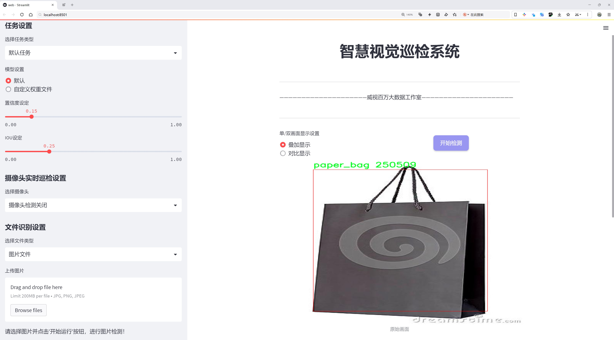
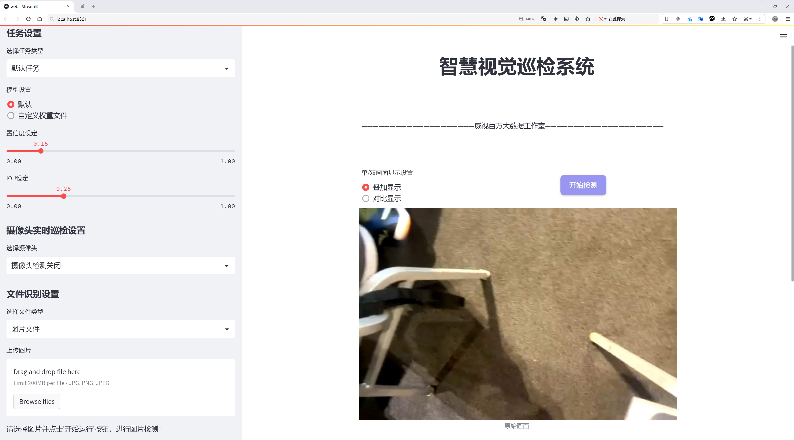
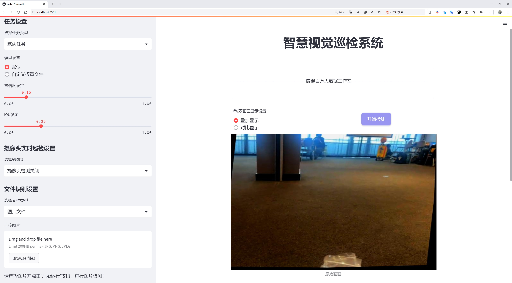
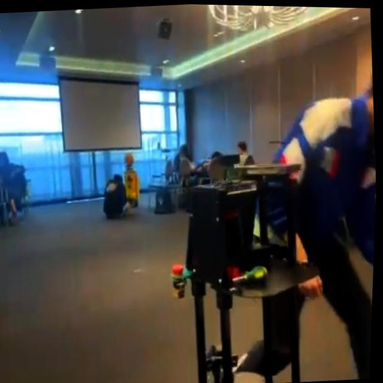
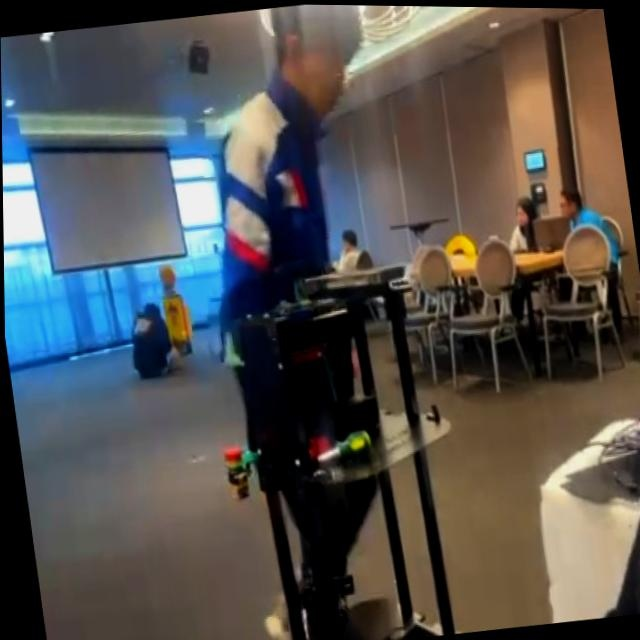
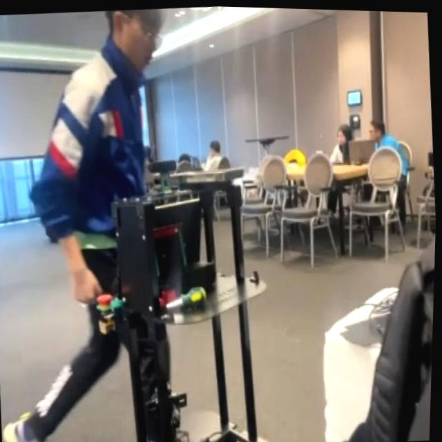
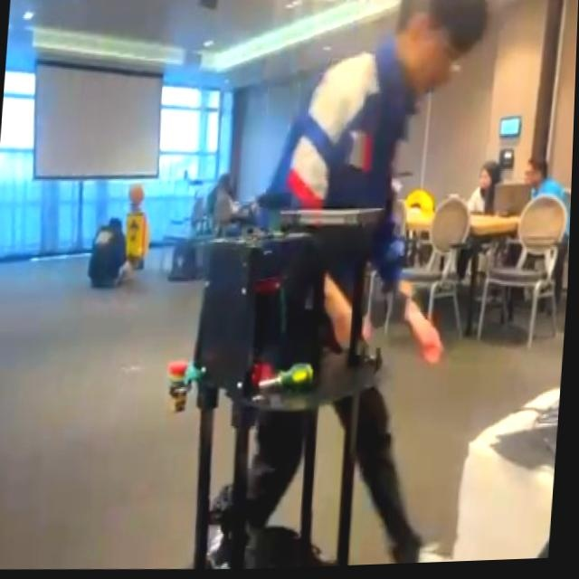

# 纸手提袋检测检测系统源码分享
 # [一条龙教学YOLOV8标注好的数据集一键训练_70+全套改进创新点发刊_Web前端展示]

### 1.研究背景与意义

项目参考[AAAI Association for the Advancement of Artificial Intelligence](https://gitee.com/qunshansj/projects)

项目来源[AACV Association for the Advancement of Computer Vision](https://gitee.com/qunmasj/projects)

研究背景与意义

随着环保意识的不断增强，纸手提袋作为一种可降解、可回收的包装材料，逐渐受到消费者和商家的青睐。纸手提袋不仅在日常生活中广泛应用于购物、礼品包装等场景，还在减少塑料使用、降低环境污染方面发挥了重要作用。然而，随着纸手提袋市场的快速发展，如何高效、准确地识别和分类这些产品，成为了商家和研究者面临的一项重要挑战。因此，基于计算机视觉和深度学习技术的纸手提袋检测系统的研究显得尤为重要。

在这一背景下，YOLO（You Only Look Once）系列目标检测算法因其高效性和实时性而受到广泛关注。YOLOv8作为该系列的最新版本，结合了多种先进的深度学习技术，具备了更强的特征提取能力和更快的检测速度。然而，尽管YOLOv8在多个目标检测任务中表现出色，但在特定应用场景下，如纸手提袋的检测，仍然存在一定的局限性。因此，改进YOLOv8以适应纸手提袋检测的需求，具有重要的理论和实践意义。

本研究将利用一个包含1700张图像的专用数据集（Module Name: bag_white），该数据集专注于纸手提袋的检测，类别数量为1，涵盖了多种不同角度和背景下的纸手提袋图像。通过对该数据集的深入分析与处理，我们将探索如何优化YOLOv8模型的结构和参数，以提高其在纸手提袋检测任务中的准确性和鲁棒性。这一过程不仅能够为纸手提袋的自动化检测提供技术支持，还将为其他类似物品的检测任务提供借鉴。

此外，基于改进YOLOv8的纸手提袋检测系统的研究，将为商家提供高效的库存管理和销售分析工具。通过实时监测纸手提袋的使用情况，商家能够更好地掌握市场需求，优化产品供应链，降低运营成本。同时，该系统的推广应用也将促进消费者对环保产品的认知和使用，进一步推动可持续发展的社会进程。

总之，基于改进YOLOv8的纸手提袋检测系统的研究，不仅在技术层面上具有重要的创新意义，还在社会层面上具有广泛的应用前景。通过这一研究，我们期望能够为纸手提袋的智能检测提供有效的解决方案，助力环保事业的发展，并为未来的相关研究奠定基础。

### 2.图片演示







##### 注意：由于此博客编辑较早，上面“2.图片演示”和“3.视频演示”展示的系统图片或者视频可能为老版本，新版本在老版本的基础上升级如下：（实际效果以升级的新版本为准）

  （1）适配了YOLOV8的“目标检测”模型和“实例分割”模型，通过加载相应的权重（.pt）文件即可自适应加载模型。

  （2）支持“图片识别”、“视频识别”、“摄像头实时识别”三种识别模式。

  （3）支持“图片识别”、“视频识别”、“摄像头实时识别”三种识别结果保存导出，解决手动导出（容易卡顿出现爆内存）存在的问题，识别完自动保存结果并导出到tempDir中。

  （4）支持Web前端系统中的标题、背景图等自定义修改，后面提供修改教程。

  另外本项目提供训练的数据集和训练教程,暂不提供权重文件（best.pt）,需要您按照教程进行训练后实现图片演示和Web前端界面演示的效果。

### 3.视频演示

[3.1 视频演示](https://www.bilibili.com/video/BV1iY4veHE2c/)

### 4.数据集信息展示

##### 4.1 本项目数据集详细数据（类别数＆类别名）

nc: 1
names: ['paper_bag']


##### 4.2 本项目数据集信息介绍

数据集信息展示

在本研究中，我们使用了名为“bag_white”的数据集，以训练和改进YOLOv8模型在纸手提袋检测任务中的表现。该数据集专注于单一类别的物体检测，具体为“paper_bag”，这使得模型在特定任务上的学习更加集中和高效。通过聚焦于纸手提袋这一特定物体，数据集的设计旨在提升模型在实际应用中的准确性和鲁棒性，尤其是在复杂背景和多样化环境下的表现。

“bag_white”数据集的构建过程经过精心设计，确保所收集的图像在质量和多样性上均能满足训练需求。数据集中包含了多种场景下的纸手提袋图像，这些图像涵盖了不同的拍摄角度、光照条件和背景环境。这种多样性不仅有助于模型学习到纸手提袋的特征，还能提高其在实际应用中的适应能力。通过引入不同的背景和光照变化，模型能够更好地理解纸手提袋在不同环境中的表现，从而在真实世界的应用中实现更高的检测精度。

在数据集的标注过程中，采用了严格的标注标准，确保每张图像中的纸手提袋都被准确地框定和标识。这样的标注不仅提升了数据集的质量，也为后续的模型训练提供了可靠的基础。标注的准确性直接影响到模型的学习效果，因此在数据集的构建阶段，团队进行了多轮的审核和校正，以确保每个标注的准确性和一致性。

为了进一步增强模型的泛化能力，数据集还进行了数据增强处理。这包括对图像进行旋转、缩放、裁剪和颜色调整等操作，以生成更多的训练样本。这种数据增强策略不仅增加了训练数据的多样性，还帮助模型在面对不同的输入时，能够保持较高的检测性能。这一过程在一定程度上模拟了真实世界中可能遇到的各种情况，使得模型在实际应用中能够更加稳健。

此外，数据集的规模和质量也为模型的训练提供了良好的基础。虽然“bag_white”数据集仅包含一个类别，但其丰富的图像内容和高质量的标注，使得模型能够在学习过程中充分提取到有用的特征。这种特征提取的有效性将直接影响到模型在测试阶段的表现，从而提升其在纸手提袋检测任务中的准确率和召回率。

综上所述，“bag_white”数据集为改进YOLOv8的纸手提袋检测系统提供了一个高质量的训练基础。通过专注于单一类别的设计、严格的标注标准以及有效的数据增强策略，该数据集不仅提升了模型的学习效果，也为其在实际应用中的表现奠定了坚实的基础。随着研究的深入，我们期待该数据集能够在未来的研究和应用中发挥更大的作用，为纸手提袋的智能检测提供更为强大的技术支持。










### 5.全套项目环境部署视频教程（零基础手把手教学）

[5.1 环境部署教程链接（零基础手把手教学）](https://www.ixigua.com/7404473917358506534?logTag=c807d0cbc21c0ef59de5)


[5.2 安装Python虚拟环境创建和依赖库安装视频教程链接（零基础手把手教学）](https://www.ixigua.com/7404474678003106304?logTag=1f1041108cd1f708b01a)

### 6.手把手YOLOV8训练视频教程（零基础小白有手就能学会）

[6.1 手把手YOLOV8训练视频教程（零基础小白有手就能学会）](https://www.ixigua.com/7404477157818401292?logTag=d31a2dfd1983c9668658)

### 7.70+种全套YOLOV8创新点代码加载调参视频教程（一键加载写好的改进模型的配置文件）

[7.1 70+种全套YOLOV8创新点代码加载调参视频教程（一键加载写好的改进模型的配置文件）](https://www.ixigua.com/7404478314661806627?logTag=29066f8288e3f4eea3a4)

### 8.70+种全套YOLOV8创新点原理讲解（非科班也可以轻松写刊发刊，V10版本正在科研待更新）

由于篇幅限制，每个创新点的具体原理讲解就不一一展开，具体见下列网址中的创新点对应子项目的技术原理博客网址【Blog】：


[8.1 70+种全套YOLOV8创新点原理讲解链接](https://gitee.com/qunmasj/good)

### 9.系统功能展示（检测对象为举例，实际内容以本项目数据集为准）

图9.1.系统支持检测结果表格显示

  图9.2.系统支持置信度和IOU阈值手动调节

  图9.3.系统支持自定义加载权重文件best.pt(需要你通过步骤5中训练获得)

  图9.4.系统支持摄像头实时识别

  图9.5.系统支持图片识别

  图9.6.系统支持视频识别

  图9.7.系统支持识别结果文件自动保存

  图9.8.系统支持Excel导出检测结果数据


### 10.原始YOLOV8算法原理

原始YOLOv8算法原理

YOLOv8模型是由Ultralytics团队在YOLOv5的基础上进行优化和改进而来，旨在提升目标检测的精度和速度。自2023年1月提出以来，YOLOv8已经成为计算机视觉领域中备受关注的模型之一。与其前身相比，YOLOv8在多个方面进行了创新，特别是在网络结构、特征提取和损失函数设计等方面，均体现了对现代深度学习技术的深刻理解和应用。

首先，YOLOv8的网络结构由四个主要部分组成：输入层、主干网络（Backbone）、颈部网络（Neck）和检测头（Head）。输入层负责对图像进行预处理，包括调整图像比例、实现Mosaic增强等。尽管Mosaic数据增强能够提升模型的鲁棒性和泛化能力，但YOLOv8在训练的最后10个epoch中停止使用该技术，以避免破坏数据的真实分布。这一设计体现了YOLOv8在数据处理上的细致考量，确保模型能够学习到更真实的特征。

在主干网络部分，YOLOv8采用了C2f模块替代了C3模块。C2f模块的设计灵感来源于YOLOv7中的ELAN（Efficient Layer Aggregation Network），通过引入更多的跳层连接，增强了梯度流动的信息。这种结构的改进不仅保留了模型的轻量化特性，还使得特征提取更加高效。SPPF（Spatial Pyramid Pooling Fast）模块的保留进一步优化了特征图的处理，减少了执行时间而不损失性能。

颈部网络同样进行了结构上的调整，所有的C3模块都被替换为C2f模块，并且在上采样之前删除了两处卷积连接层。这一变化旨在提高特征融合的效率，确保不同尺度的特征能够更好地进行整合，从而增强模型对多样化目标的检测能力。YOLOv8的颈部网络结合了特征金字塔网络（FPN）和路径聚合网络（PAN），通过这种双塔结构，促进了语义特征和定位特征的有效转移，使得模型在处理不同尺度目标时表现得更加出色。

在检测头部分，YOLOv8引入了解耦头的概念，采用两条并行的分支分别提取类别和位置特征。这种设计的核心在于，分类任务与定位任务的侧重点不同，分类更关注特征图中提取到的特征与已有类别的相似性，而定位则更关注边界框与真实框的关系。通过分离这两个任务，YOLOv8能够加速模型的收敛，并提高预测的精度。此外，YOLOv8采用了无锚框结构，直接预测目标的中心，并引入了任务对齐学习（Task Alignment Learning，TAL）机制，以更好地区分正负样本。通过结合分类分数和IOU的高次幂乘积，YOLOv8在损失函数中引入了新的指标，从而实现了分类和定位的协同优化。

在模型性能方面，YOLOv8在COCO数据集上的表现令人瞩目。通过对比不同尺寸的模型，YOLOv8在参数数量没有显著增加的情况下，取得了更高的精度。同时，在推理速度上，YOLOv8也表现出色，确保了实时检测的需求。尤其是在垃圾目标检测等应用场景中，YOLOv8的高效性和准确性使其成为理想的选择。

总的来说，YOLOv8的设计理念和实现方法充分体现了现代目标检测算法的发展趋势，强调了模型的轻量化、特征提取的高效性以及任务之间的协同优化。随着YOLOv8的不断发展和应用，未来在更多实际场景中的表现值得期待。其在实时性和准确性之间的平衡，使得YOLOv8不仅在学术研究中具有重要价值，也在工业应用中展现出广泛的前景。


### 11.项目核心源码讲解（再也不用担心看不懂代码逻辑）

#### 11.1 70+种YOLOv8算法改进源码大全和调试加载训练教程（非必要）\ultralytics\models\yolo\model.py

以下是对代码的核心部分进行提炼和详细注释的结果：

```python
# 引入必要的模块和类
from ultralytics.engine.model import Model
from ultralytics.models import yolo  # noqa
from ultralytics.nn.tasks import ClassificationModel, DetectionModel, PoseModel, SegmentationModel

class YOLO(Model):
    """YOLO (You Only Look Once) 目标检测模型的类定义。"""

    @property
    def task_map(self):
        """将任务类型映射到相应的模型、训练器、验证器和预测器类。

        返回一个字典，其中包含四种任务类型（分类、检测、分割、姿态）及其对应的类。
        """
        return {
            'classify': {  # 分类任务
                'model': ClassificationModel,  # 分类模型
                'trainer': yolo.classify.ClassificationTrainer,  # 分类训练器
                'validator': yolo.classify.ClassificationValidator,  # 分类验证器
                'predictor': yolo.classify.ClassificationPredictor,  # 分类预测器
            },
            'detect': {  # 检测任务
                'model': DetectionModel,  # 检测模型
                'trainer': yolo.detect.DetectionTrainer,  # 检测训练器
                'validator': yolo.detect.DetectionValidator,  # 检测验证器
                'predictor': yolo.detect.DetectionPredictor,  # 检测预测器
            },
            'segment': {  # 分割任务
                'model': SegmentationModel,  # 分割模型
                'trainer': yolo.segment.SegmentationTrainer,  # 分割训练器
                'validator': yolo.segment.SegmentationValidator,  # 分割验证器
                'predictor': yolo.segment.SegmentationPredictor,  # 分割预测器
            },
            'pose': {  # 姿态估计任务
                'model': PoseModel,  # 姿态模型
                'trainer': yolo.pose.PoseTrainer,  # 姿态训练器
                'validator': yolo.pose.PoseValidator,  # 姿态验证器
                'predictor': yolo.pose.PosePredictor,  # 姿态预测器
            },
        }
```

### 代码分析与注释说明：
1. **模块导入**：引入了`Model`类以及YOLO相关的模型和任务类，这些是构建YOLO目标检测模型的基础。
  
2. **YOLO类**：继承自`Model`类，表示YOLO目标检测模型的具体实现。

3. **task_map属性**：这是一个属性方法，返回一个字典，字典的键是任务类型（如分类、检测、分割、姿态），值是一个包含模型、训练器、验证器和预测器的字典。这样做的目的是将不同的任务类型与其对应的实现类进行映射，方便后续调用。

4. **每个任务的实现**：
   - **分类**：使用`ClassificationModel`及其对应的训练、验证和预测类。
   - **检测**：使用`DetectionModel`及其对应的训练、验证和预测类。
   - **分割**：使用`SegmentationModel`及其对应的训练、验证和预测类。
   - **姿态**：使用`PoseModel`及其对应的训练、验证和预测类。

通过这种结构，YOLO模型能够灵活地支持多种任务，便于扩展和维护。

该文件定义了一个名为 `YOLO` 的类，继承自 `Model` 类，主要用于实现 YOLO（You Only Look Once）目标检测模型。YOLO 是一种流行的深度学习算法，广泛应用于实时目标检测任务。

在 `YOLO` 类中，有一个名为 `task_map` 的属性，它返回一个字典，映射了不同任务类型（如分类、检测、分割和姿态估计）到相应的模型、训练器、验证器和预测器类。这个映射关系使得在使用 YOLO 模型时，可以根据具体的任务类型选择合适的组件。

具体来说，`task_map` 字典包含以下四个任务类型：

1. **分类（classify）**：映射到 `ClassificationModel` 及其对应的训练、验证和预测类。
2. **检测（detect）**：映射到 `DetectionModel` 及其对应的训练、验证和预测类。
3. **分割（segment）**：映射到 `SegmentationModel` 及其对应的训练、验证和预测类。
4. **姿态估计（pose）**：映射到 `PoseModel` 及其对应的训练、验证和预测类。

通过这种结构，用户可以方便地根据任务需求选择和使用不同的模型和相关组件，从而实现更灵活的目标检测和其他计算机视觉任务。整体上，该文件为 YOLO 模型的实现提供了基础框架，支持多种视觉任务的处理。

#### 11.2 code\ultralytics\data\augment.py

以下是经过简化并添加详细中文注释的核心代码部分：

```python
import numpy as np
import random
import cv2

class BaseMixTransform:
    """
    基础混合变换类（MixUp/Mosaic），用于数据增强。
    """

    def __init__(self, dataset, pre_transform=None, p=0.0) -> None:
        """
        初始化BaseMixTransform对象。

        参数：
            dataset: 数据集对象。
            pre_transform: 预处理变换（可选）。
            p: 应用混合变换的概率。
        """
        self.dataset = dataset
        self.pre_transform = pre_transform
        self.p = p

    def __call__(self, labels):
        """
        应用预处理变换和混合变换到标签数据。

        参数：
            labels: 标签字典，包含图像和实例信息。

        返回：
            处理后的标签字典。
        """
        if random.uniform(0, 1) > self.p:
            return labels  # 按照概率决定是否应用变换

        # 获取其他图像的索引
        indexes = self.get_indexes()
        if isinstance(indexes, int):
            indexes = [indexes]

        # 获取用于混合的图像信息
        mix_labels = [self.dataset.get_image_and_label(i) for i in indexes]

        if self.pre_transform is not None:
            for i, data in enumerate(mix_labels):
                mix_labels[i] = self.pre_transform(data)  # 应用预处理变换
        labels["mix_labels"] = mix_labels

        # 应用混合变换
        labels = self._mix_transform(labels)
        labels.pop("mix_labels", None)  # 移除临时数据
        return labels

    def _mix_transform(self, labels):
        """应用MixUp或Mosaic增强到标签字典。"""
        raise NotImplementedError

    def get_indexes(self):
        """获取用于马赛克增强的随机索引列表。"""
        raise NotImplementedError


class Mosaic(BaseMixTransform):
    """
    马赛克增强类，将多个图像组合成一个马赛克图像。
    """

    def __init__(self, dataset, imgsz=640, p=1.0, n=4):
        """
        初始化Mosaic对象。

        参数：
            dataset: 数据集对象。
            imgsz: 单个图像的目标大小。
            p: 应用马赛克增强的概率。
            n: 网格大小（4或9）。
        """
        assert 0 <= p <= 1.0, f"概率应在[0, 1]范围内，但得到{p}。"
        assert n in (4, 9), "网格大小必须为4或9。"
        super().__init__(dataset=dataset, p=p)
        self.imgsz = imgsz
        self.n = n

    def get_indexes(self, buffer=True):
        """返回数据集中随机索引的列表。"""
        if buffer:  # 从缓冲区选择图像
            return random.choices(list(self.dataset.buffer), k=self.n - 1)
        else:  # 随机选择图像
            return [random.randint(0, len(self.dataset) - 1) for _ in range(self.n - 1)]

    def _mix_transform(self, labels):
        """应用马赛克增强到输入图像和标签。"""
        return self._mosaic4(labels) if self.n == 4 else self._mosaic9(labels)

    def _mosaic4(self, labels):
        """创建一个2x2的马赛克图像。"""
        mosaic_labels = []
        s = self.imgsz
        img4 = np.full((s * 2, s * 2, 3), 114, dtype=np.uint8)  # 创建一个空白的马赛克图像

        for i in range(4):
            labels_patch = labels if i == 0 else labels["mix_labels"][i - 1]
            img = labels_patch["img"]
            h, w = labels_patch.pop("resized_shape")

            # 计算每个图像在马赛克中的位置
            if i == 0:  # 左上角
                x1, y1, x2, y2 = 0, 0, w, h
            elif i == 1:  # 右上角
                x1, y1, x2, y2 = s, 0, s + w, h
            elif i == 2:  # 左下角
                x1, y1, x2, y2 = 0, s, w, s + h
            elif i == 3:  # 右下角
                x1, y1, x2, y2 = s, s, s + w, s + h

            img4[y1:y2, x1:x2] = img  # 将图像放入马赛克图像中
            mosaic_labels.append(labels_patch)

        final_labels = self._cat_labels(mosaic_labels)
        final_labels["img"] = img4  # 更新最终的马赛克图像
        return final_labels

    def _cat_labels(self, mosaic_labels):
        """返回带有马赛克边界实例剪裁的标签。"""
        cls = []
        instances = []
        for labels in mosaic_labels:
            cls.append(labels["cls"])
            instances.append(labels["instances"])
        final_labels = {
            "cls": np.concatenate(cls, 0),
            "instances": Instances.concatenate(instances, axis=0),
        }
        return final_labels


class RandomFlip:
    """
    随机翻转图像类，支持水平或垂直翻转。
    """

    def __init__(self, p=0.5, direction="horizontal") -> None:
        """
        初始化RandomFlip对象。

        参数：
            p: 应用翻转的概率。
            direction: 翻转方向（"horizontal"或"vertical"）。
        """
        assert direction in ["horizontal", "vertical"], f"支持的方向为'horizontal'或'vertical'，但得到{direction}"
        assert 0 <= p <= 1.0
        self.p = p
        self.direction = direction

    def __call__(self, labels):
        """
        应用随机翻转到图像并更新实例。

        参数：
            labels: 包含图像和实例的字典。

        返回：
            更新后的标签字典。
        """
        img = labels["img"]
        if self.direction == "vertical" and random.random() < self.p:
            img = np.flipud(img)  # 垂直翻转
        if self.direction == "horizontal" and random.random() < self.p:
            img = np.fliplr(img)  # 水平翻转
        labels["img"] = img
        return labels
```

### 代码说明
1. **BaseMixTransform**: 这是一个基础类，用于实现混合变换（如MixUp和Mosaic）。它定义了初始化和调用方法，并提供了获取索引和混合变换的接口。
  
2. **Mosaic**: 继承自`BaseMixTransform`，实现了马赛克增强。它将多个图像组合成一个马赛克图像，并提供了生成随机索引和合并标签的方法。

3. **RandomFlip**: 实现随机翻转图像的功能。可以选择水平或垂直翻转，并根据设定的概率应用翻转。

以上代码部分保留了核心功能，并添加了详细的中文注释，以便于理解和使用。

这个程序文件是用于图像增强的，主要应用于目标检测和图像分类任务。文件中定义了多个类和方法，用于实现不同的图像增强技术。以下是对代码的详细讲解。

首先，文件导入了一些必要的库，包括数学运算、随机数生成、图像处理库（OpenCV和NumPy）、深度学习框架（PyTorch和Torchvision）等。接着，定义了一些默认的参数，比如图像的均值和标准差。

接下来，定义了一个基础的图像变换类`BaseTransform`，该类是其他变换类的基类，提供了初始化和应用变换的方法。具体的图像变换操作在子类中实现。

`Compose`类用于将多个图像变换组合在一起。它接受一个变换列表，并在调用时依次应用这些变换。

`BaseMixTransform`类是用于实现混合增强（如MixUp和Mosaic）的基类。它的子类`Mosaic`实现了马赛克增强，通过将多个图像组合成一个图像来增加数据的多样性。`Mosaic`类可以选择4个或9个图像进行组合，并且可以通过概率参数控制是否应用这种增强。

`MixUp`类则实现了MixUp增强，通过将两张图像混合来生成新的图像。它使用Beta分布来决定混合的比例。

`RandomPerspective`类实现了随机透视变换和仿射变换，能够对图像进行旋转、平移、缩放和剪切等操作，同时更新对应的边界框、分割和关键点。

`RandomHSV`类用于随机调整图像的色调、饱和度和亮度，以增加图像的多样性。

`RandomFlip`类实现了随机翻转图像的功能，可以选择水平或垂直翻转，并更新相应的实例（如边界框和关键点）。

`LetterBox`类用于调整图像大小并添加边框，以适应目标检测和实例分割的需求。它会保持图像的长宽比，并在必要时进行填充。

`CopyPaste`类实现了图像的复制粘贴增强，能够将一部分图像复制到另一部分，以增加数据的多样性。

`Albumentations`类提供了一些额外的图像增强功能，利用`albumentations`库进行模糊、对比度调整等操作。

`Format`类用于格式化图像注释，以便在PyTorch的DataLoader中使用。它可以处理边界框、分割掩码和关键点等信息。

最后，文件中还定义了一些函数，如`v8_transforms`和`classify_transforms`，用于创建特定的图像增强管道，以便在训练和评估时使用。

总体来说，这个文件提供了一系列灵活且强大的图像增强方法，旨在提高模型的泛化能力和鲁棒性。通过组合不同的增强技术，可以有效地扩展训练数据集，帮助模型更好地学习和识别目标。

#### 11.3 ui.py

```python
import sys
import subprocess

def run_script(script_path):
    """
    使用当前 Python 环境运行指定的脚本。

    Args:
        script_path (str): 要运行的脚本路径

    Returns:
        None
    """
    # 获取当前 Python 解释器的路径
    python_path = sys.executable

    # 构建运行命令，使用 streamlit 运行指定的脚本
    command = f'"{python_path}" -m streamlit run "{script_path}"'

    # 执行命令
    result = subprocess.run(command, shell=True)
    # 检查命令执行的返回码，如果不为0则表示出错
    if result.returncode != 0:
        print("脚本运行出错。")

# 实例化并运行应用
if __name__ == "__main__":
    # 指定要运行的脚本路径
    script_path = "web.py"  # 这里可以替换为实际的脚本路径

    # 运行脚本
    run_script(script_path)
```

### 代码核心部分及注释说明：

1. **导入模块**：
   - `import sys`: 导入系统相关的模块，用于获取当前 Python 解释器的路径。
   - `import subprocess`: 导入子进程模块，用于执行外部命令。

2. **定义 `run_script` 函数**：
   - 该函数接受一个参数 `script_path`，表示要运行的 Python 脚本的路径。
   - 使用 `sys.executable` 获取当前 Python 解释器的路径，以确保使用正确的 Python 环境来运行脚本。
   - 构建一个命令字符串，使用 `streamlit` 模块运行指定的脚本。
   - 使用 `subprocess.run` 执行构建的命令，并检查返回码以判断脚本是否成功运行。

3. **主程序入口**：
   - 使用 `if __name__ == "__main__":` 确保该部分代码仅在直接运行该脚本时执行。
   - 指定要运行的脚本路径 `script_path`，并调用 `run_script` 函数来执行该脚本。

这个程序文件的主要功能是使用当前的 Python 环境来运行一个指定的脚本，具体来说是运行一个名为 `web.py` 的脚本。程序首先导入了必要的模块，包括 `sys`、`os` 和 `subprocess`，这些模块提供了与系统交互和执行外部命令的功能。此外，还导入了 `abs_path` 函数，这个函数可能用于获取脚本的绝对路径。

在 `run_script` 函数中，首先获取当前 Python 解释器的路径，这通过 `sys.executable` 实现。接着，构建一个命令字符串，这个命令会调用 `streamlit` 来运行指定的脚本。`streamlit` 是一个用于构建数据应用的库，命令的格式是将 Python 解释器与 `-m streamlit run` 和脚本路径结合起来。

然后，使用 `subprocess.run` 方法来执行这个命令。`shell=True` 参数允许在 shell 中执行命令，这样可以直接使用字符串格式的命令。执行完命令后，程序检查返回的状态码，如果状态码不为 0，表示脚本运行出错，程序会打印出错误信息。

在文件的最后部分，使用 `if __name__ == "__main__":` 语句来确保只有在直接运行该文件时才会执行下面的代码。这里指定了要运行的脚本路径，调用 `abs_path` 函数获取 `web.py` 的绝对路径，并将其传递给 `run_script` 函数来执行。

总体来说，这个程序的目的是提供一个简单的接口来运行一个 Streamlit 应用，方便用户在当前 Python 环境中启动和测试该应用。

#### 11.4 70+种YOLOv8算法改进源码大全和调试加载训练教程（非必要）\ultralytics\models\yolo\classify\train.py

以下是经过简化和注释的核心代码部分，主要集中在分类训练器的实现上：

```python
import torch
from ultralytics.data import ClassificationDataset, build_dataloader
from ultralytics.engine.trainer import BaseTrainer
from ultralytics.models import yolo
from ultralytics.nn.tasks import ClassificationModel, attempt_load_one_weight
from ultralytics.utils import DEFAULT_CFG, LOGGER, RANK, colorstr
from ultralytics.utils.torch_utils import is_parallel, strip_optimizer, torch_distributed_zero_first

class ClassificationTrainer(BaseTrainer):
    """
    分类训练器类，继承自 BaseTrainer，用于基于分类模型的训练。
    """

    def __init__(self, cfg=DEFAULT_CFG, overrides=None, _callbacks=None):
        """初始化分类训练器对象，支持配置覆盖和回调函数。"""
        if overrides is None:
            overrides = {}
        overrides['task'] = 'classify'  # 设置任务类型为分类
        if overrides.get('imgsz') is None:
            overrides['imgsz'] = 224  # 默认图像大小为224
        super().__init__(cfg, overrides, _callbacks)

    def set_model_attributes(self):
        """从加载的数据集中设置YOLO模型的类名。"""
        self.model.names = self.data['names']

    def get_model(self, cfg=None, weights=None, verbose=True):
        """返回配置好的PyTorch模型以进行YOLO训练。"""
        model = ClassificationModel(cfg, nc=self.data['nc'], verbose=verbose and RANK == -1)
        if weights:
            model.load(weights)  # 加载权重

        for m in model.modules():
            if not self.args.pretrained and hasattr(m, 'reset_parameters'):
                m.reset_parameters()  # 重置参数
            if isinstance(m, torch.nn.Dropout) and self.args.dropout:
                m.p = self.args.dropout  # 设置dropout概率
        for p in model.parameters():
            p.requires_grad = True  # 允许训练
        return model

    def build_dataset(self, img_path, mode='train'):
        """根据图像路径和模式（训练/测试等）创建ClassificationDataset实例。"""
        return ClassificationDataset(root=img_path, args=self.args, augment=mode == 'train', prefix=mode)

    def get_dataloader(self, dataset_path, batch_size=16, rank=0, mode='train'):
        """返回用于推理的PyTorch DataLoader，并对图像进行预处理。"""
        with torch_distributed_zero_first(rank):  # DDP时只初始化一次数据集
            dataset = self.build_dataset(dataset_path, mode)

        loader = build_dataloader(dataset, batch_size, self.args.workers, rank=rank)
        # 附加推理变换
        if mode != 'train':
            if is_parallel(self.model):
                self.model.module.transforms = loader.dataset.torch_transforms
            else:
                self.model.transforms = loader.dataset.torch_transforms
        return loader

    def preprocess_batch(self, batch):
        """预处理一批图像和类标签。"""
        batch['img'] = batch['img'].to(self.device)  # 将图像转移到设备
        batch['cls'] = batch['cls'].to(self.device)  # 将类标签转移到设备
        return batch

    def get_validator(self):
        """返回分类验证器的实例，用于验证。"""
        self.loss_names = ['loss']  # 定义损失名称
        return yolo.classify.ClassificationValidator(self.test_loader, self.save_dir)

    def final_eval(self):
        """评估训练后的模型并保存验证结果。"""
        for f in self.last, self.best:
            if f.exists():
                strip_optimizer(f)  # 去除优化器信息
                if f is self.best:
                    LOGGER.info(f'\nValidating {f}...')
                    self.metrics = self.validator(model=f)  # 验证模型
                    self.metrics.pop('fitness', None)  # 移除不需要的指标
        LOGGER.info(f"Results saved to {colorstr('bold', self.save_dir)}")  # 打印结果保存路径
```

### 代码说明：
1. **导入必要的库**：导入PyTorch和Ultralytics库中的相关模块。
2. **ClassificationTrainer类**：定义了一个分类训练器类，继承自基础训练器`BaseTrainer`，用于分类任务的训练。
3. **初始化方法**：设置任务类型为分类，并指定默认图像大小。
4. **模型属性设置**：从数据集中获取类名并设置到模型中。
5. **获取模型**：创建并返回一个配置好的分类模型，并根据需要加载权重。
6. **构建数据集**：根据给定的图像路径和模式（训练或测试）创建数据集实例。
7. **获取数据加载器**：返回一个PyTorch数据加载器，负责加载和预处理数据。
8. **预处理批次**：将图像和类标签转移到指定设备（如GPU）。
9. **获取验证器**：返回一个验证器实例，用于模型验证。
10. **最终评估**：对训练后的模型进行评估，并保存验证结果。

这个程序文件是一个用于训练YOLOv8分类模型的Python脚本，主要继承自`BaseTrainer`类。它的核心功能是设置和管理模型的训练过程，支持图像分类任务。

首先，文件导入了一些必要的库和模块，包括PyTorch、Torchvision以及Ultralytics提供的相关工具和数据集类。接着，定义了一个`ClassificationTrainer`类，该类专门用于处理分类任务的训练。

在类的初始化方法中，设置了一些默认参数，例如图像大小（默认为224），并调用父类的初始化方法。`set_model_attributes`方法用于从加载的数据集中设置模型的类名，以便模型能够识别不同的类别。

`get_model`方法用于返回一个配置好的PyTorch模型，支持加载预训练权重，并对模型的各个模块进行参数重置和设置。`setup_model`方法则负责加载模型，可以从本地文件、Torchvision模型或Ultralytics资源中获取模型。如果模型文件不存在，会抛出错误。

`build_dataset`方法创建一个分类数据集实例，`get_dataloader`方法返回一个PyTorch数据加载器，负责对图像进行预处理并加载数据。`preprocess_batch`方法则对一批图像和标签进行预处理，将它们移动到指定的设备上（如GPU）。

`progress_string`方法返回一个格式化的字符串，用于显示训练进度。`get_validator`方法返回一个验证器实例，用于模型的验证过程。`label_loss_items`方法生成一个带有标签的损失字典，尽管在分类任务中并不常用，但在其他任务中可能会需要。

`plot_metrics`方法用于从CSV文件中绘制训练过程中的指标图，`final_eval`方法在训练结束后评估模型并保存验证结果。最后，`plot_training_samples`方法用于绘制训练样本及其注释，以便可视化训练过程。

总体来说，这个脚本提供了一个完整的框架，用于训练YOLOv8模型进行图像分类，涵盖了模型的设置、数据处理、训练过程管理和结果可视化等多个方面。

#### 11.5 70+种YOLOv8算法改进源码大全和调试加载训练教程（非必要）\ultralytics\data\dataset.py

以下是代码中最核心的部分，并附上详细的中文注释：

```python
import numpy as np
import torch
from pathlib import Path
from ultralytics.utils import TQDM, LOGGER, get_hash, img2label_paths, verify_image, verify_image_label

# Ultralytics 数据集缓存版本，>= 1.0.0 用于 YOLOv8
DATASET_CACHE_VERSION = '1.0.3'

class YOLODataset:
    """
    YOLO 数据集类，用于加载 YOLO 格式的目标检测和/或分割标签。

    参数:
        data (dict, optional): 数据集的 YAML 字典。默认为 None。
        use_segments (bool, optional): 如果为 True，则使用分割掩码作为标签。默认为 False。
        use_keypoints (bool, optional): 如果为 True，则使用关键点作为标签。默认为 False。
    """

    def __init__(self, data=None, use_segments=False, use_keypoints=False):
        """初始化 YOLODataset，配置分割和关键点的选项。"""
        self.use_segments = use_segments
        self.use_keypoints = use_keypoints
        self.data = data
        assert not (self.use_segments and self.use_keypoints), '不能同时使用分割和关键点。'

    def cache_labels(self, path=Path('./labels.cache')):
        """
        缓存数据集标签，检查图像并读取形状。

        参数:
            path (Path): 保存缓存文件的路径（默认: Path('./labels.cache')）。
        返回:
            (dict): 标签字典。
        """
        x = {'labels': []}
        nm, nf, ne, nc, msgs = 0, 0, 0, 0, []  # 统计缺失、找到、空、损坏的数量和消息
        total = len(self.im_files)  # 图像文件总数
        nkpt, ndim = self.data.get('kpt_shape', (0, 0))  # 获取关键点形状

        # 使用多线程池验证图像和标签
        with ThreadPool(NUM_THREADS) as pool:
            results = pool.imap(func=verify_image_label,
                                iterable=zip(self.im_files, self.label_files))
            pbar = TQDM(results, desc='扫描中...', total=total)
            for im_file, lb, shape, segments, keypoint, nm_f, nf_f, ne_f, nc_f, msg in pbar:
                nm += nm_f
                nf += nf_f
                ne += ne_f
                nc += nc_f
                if im_file:
                    x['labels'].append(
                        dict(
                            im_file=im_file,
                            shape=shape,
                            cls=lb[:, 0:1],  # 类别
                            bboxes=lb[:, 1:],  # 边界框
                            segments=segments,
                            keypoints=keypoint,
                            normalized=True,
                            bbox_format='xywh'))  # 边界框格式
                if msg:
                    msgs.append(msg)
                pbar.desc = f'扫描中... {nf} 张图像, {nm + ne} 背景, {nc} 损坏'
            pbar.close()

        if msgs:
            LOGGER.info('\n'.join(msgs))  # 记录警告信息
        x['hash'] = get_hash(self.label_files + self.im_files)  # 生成标签文件和图像文件的哈希值
        save_dataset_cache_file('YOLODataset', path, x)  # 保存缓存文件
        return x

    def get_labels(self):
        """返回 YOLO 训练的标签字典。"""
        self.label_files = img2label_paths(self.im_files)  # 获取标签文件路径
        cache_path = Path(self.label_files[0]).parent.with_suffix('.cache')  # 缓存文件路径
        try:
            cache, exists = load_dataset_cache_file(cache_path), True  # 尝试加载缓存文件
            assert cache['version'] == DATASET_CACHE_VERSION  # 检查版本
            assert cache['hash'] == get_hash(self.label_files + self.im_files)  # 检查哈希值
        except (FileNotFoundError, AssertionError):
            cache, exists = self.cache_labels(cache_path), False  # 运行缓存操作

        # 读取缓存
        labels = cache['labels']
        if not labels:
            LOGGER.warning(f'警告 ⚠️ 在 {cache_path} 中未找到图像，训练可能无法正常工作。')
        self.im_files = [lb['im_file'] for lb in labels]  # 更新图像文件列表
        return labels

def load_dataset_cache_file(path):
    """从路径加载 Ultralytics *.cache 字典。"""
    cache = np.load(str(path), allow_pickle=True).item()  # 加载字典
    return cache

def save_dataset_cache_file(prefix, path, x):
    """将 Ultralytics 数据集 *.cache 字典 x 保存到路径。"""
    x['version'] = DATASET_CACHE_VERSION  # 添加缓存版本
    if path.exists():
        path.unlink()  # 如果存在，则删除缓存文件
    np.save(str(path), x)  # 保存缓存
    LOGGER.info(f'{prefix} 新缓存已创建: {path}')
```

### 代码核心部分说明：
1. **YOLODataset 类**：这是一个用于处理 YOLO 格式数据集的类，主要功能是加载图像和标签，验证它们的有效性，并缓存这些信息以加快后续的加载速度。
2. **cache_labels 方法**：该方法负责缓存标签信息，检查图像的有效性，并记录相关的统计信息（如找到的图像数量、损坏的图像数量等）。
3. **get_labels 方法**：该方法用于获取标签信息，如果缓存存在且有效，则直接使用缓存，否则重新生成缓存。
4. **load_dataset_cache_file 和 save_dataset_cache_file 方法**：这两个方法用于加载和保存数据集的缓存文件，以提高数据加载的效率。

这个程序文件是一个用于YOLOv8算法的数据集处理模块，主要负责加载和处理用于目标检测和分类的图像数据。文件中定义了多个类和函数，以便于在训练模型时有效地管理数据集。

首先，文件导入了一些必要的库，包括用于图像处理的OpenCV、NumPy和PyTorch等。它还引入了一些Ultralytics库中的工具函数和常量，例如用于日志记录和缓存管理的功能。

文件中定义了一个名为`YOLODataset`的类，它继承自`BaseDataset`。这个类的主要功能是加载YOLO格式的目标检测和分割标签。构造函数接受一些参数，包括数据集的配置、是否使用分割掩码和关键点等。类中包含了多个方法，最重要的包括`cache_labels`和`get_labels`。`cache_labels`方法用于缓存数据集标签，检查图像的有效性并读取其形状。它会返回一个包含标签信息的字典。`get_labels`方法则用于获取标签字典，并支持从缓存中加载数据以提高效率。

在`YOLODataset`类中，还有一个`build_transforms`方法，用于构建数据增强的转换操作。根据是否启用增强，它会选择不同的转换方式。`close_mosaic`方法则用于关闭某些数据增强选项并重新构建转换。

接下来，文件中定义了一个`ClassificationDataset`类，继承自`torchvision.datasets.ImageFolder`，用于处理YOLO分类数据集。这个类的构造函数接受数据集路径、参数设置、增强选项和缓存设置。它实现了`__getitem__`和`__len__`方法，分别用于获取数据集中的样本和返回样本总数。

`verify_images`方法用于验证数据集中所有图像的有效性，并生成缓存文件以加快后续加载速度。

此外，文件还定义了用于加载和保存数据集缓存的函数`load_dataset_cache_file`和`save_dataset_cache_file`，以便在后续的训练中提高数据加载的效率。

最后，文件中有一个`SemanticDataset`类的占位符，表示将来可能会添加用于语义分割的数据集处理功能。

总体来说，这个文件提供了一个灵活且高效的数据集管理工具，能够支持YOLOv8算法的训练需求。通过合理的缓存机制和数据增强策略，用户可以更方便地处理大规模数据集，提高模型训练的效率和效果。

#### 11.6 train.py

以下是代码中最核心的部分，并附上详细的中文注释：

```python
class DetectionTrainer(BaseTrainer):
    """
    DetectionTrainer类，继承自BaseTrainer类，用于基于检测模型的训练。
    """

    def build_dataset(self, img_path, mode="train", batch=None):
        """
        构建YOLO数据集。

        参数:
            img_path (str): 包含图像的文件夹路径。
            mode (str): 模式，可以是'train'或'val'，用户可以为每种模式自定义不同的数据增强。
            batch (int, optional): 批次大小，仅在'rect'模式下使用。默认为None。
        """
        gs = max(int(de_parallel(self.model).stride.max() if self.model else 0), 32)
        return build_yolo_dataset(self.args, img_path, batch, self.data, mode=mode, rect=mode == "val", stride=gs)

    def get_dataloader(self, dataset_path, batch_size=16, rank=0, mode="train"):
        """构造并返回数据加载器。"""
        assert mode in ["train", "val"]  # 确保模式是'train'或'val'
        with torch_distributed_zero_first(rank):  # 在分布式环境中，确保数据集只初始化一次
            dataset = self.build_dataset(dataset_path, mode, batch_size)  # 构建数据集
        shuffle = mode == "train"  # 训练模式下打乱数据
        if getattr(dataset, "rect", False) and shuffle:
            LOGGER.warning("WARNING ⚠️ 'rect=True'与DataLoader的shuffle不兼容，设置shuffle=False")
            shuffle = False
        workers = self.args.workers if mode == "train" else self.args.workers * 2  # 设置工作线程数
        return build_dataloader(dataset, batch_size, workers, shuffle, rank)  # 返回数据加载器

    def preprocess_batch(self, batch):
        """对一批图像进行预处理，包括缩放和转换为浮点数。"""
        batch["img"] = batch["img"].to(self.device, non_blocking=True).float() / 255  # 将图像转换为浮点数并归一化
        if self.args.multi_scale:  # 如果启用多尺度
            imgs = batch["img"]
            sz = (
                random.randrange(self.args.imgsz * 0.5, self.args.imgsz * 1.5 + self.stride)
                // self.stride
                * self.stride
            )  # 随机选择新的图像大小
            sf = sz / max(imgs.shape[2:])  # 计算缩放因子
            if sf != 1:  # 如果缩放因子不为1
                ns = [
                    math.ceil(x * sf / self.stride) * self.stride for x in imgs.shape[2:]
                ]  # 计算新的形状
                imgs = nn.functional.interpolate(imgs, size=ns, mode="bilinear", align_corners=False)  # 进行插值缩放
            batch["img"] = imgs  # 更新批次中的图像
        return batch

    def set_model_attributes(self):
        """设置模型的属性，包括类别数量和名称。"""
        self.model.nc = self.data["nc"]  # 将类别数量附加到模型
        self.model.names = self.data["names"]  # 将类别名称附加到模型
        self.model.args = self.args  # 将超参数附加到模型

    def get_model(self, cfg=None, weights=None, verbose=True):
        """返回YOLO检测模型。"""
        model = DetectionModel(cfg, nc=self.data["nc"], verbose=verbose and RANK == -1)  # 创建检测模型
        if weights:
            model.load(weights)  # 加载权重
        return model

    def get_validator(self):
        """返回用于YOLO模型验证的DetectionValidator。"""
        self.loss_names = "box_loss", "cls_loss", "dfl_loss"  # 定义损失名称
        return yolo.detect.DetectionValidator(
            self.test_loader, save_dir=self.save_dir, args=copy(self.args), _callbacks=self.callbacks
        )

    def label_loss_items(self, loss_items=None, prefix="train"):
        """
        返回带有标签的训练损失项的字典。

        对于分类不需要，但对于分割和检测是必要的。
        """
        keys = [f"{prefix}/{x}" for x in self.loss_names]  # 创建损失项的键
        if loss_items is not None:
            loss_items = [round(float(x), 5) for x in loss_items]  # 将张量转换为5位小数的浮点数
            return dict(zip(keys, loss_items))  # 返回损失项字典
        else:
            return keys

    def progress_string(self):
        """返回格式化的训练进度字符串，包括epoch、GPU内存、损失、实例和大小。"""
        return ("\n" + "%11s" * (4 + len(self.loss_names))) % (
            "Epoch",
            "GPU_mem",
            *self.loss_names,
            "Instances",
            "Size",
        )

    def plot_training_samples(self, batch, ni):
        """绘制带有注释的训练样本。"""
        plot_images(
            images=batch["img"],
            batch_idx=batch["batch_idx"],
            cls=batch["cls"].squeeze(-1),
            bboxes=batch["bboxes"],
            paths=batch["im_file"],
            fname=self.save_dir / f"train_batch{ni}.jpg",
            on_plot=self.on_plot,
        )

    def plot_metrics(self):
        """从CSV文件中绘制指标。"""
        plot_results(file=self.csv, on_plot=self.on_plot)  # 保存结果图像

    def plot_training_labels(self):
        """创建YOLO模型的标记训练图。"""
        boxes = np.concatenate([lb["bboxes"] for lb in self.train_loader.dataset.labels], 0)  # 合并所有边界框
        cls = np.concatenate([lb["cls"] for lb in self.train_loader.dataset.labels], 0)  # 合并所有类别
        plot_labels(boxes, cls.squeeze(), names=self.data["names"], save_dir=self.save_dir, on_plot=self.on_plot)  # 绘制标签
```

以上代码主要实现了YOLO模型的训练过程，包括数据集的构建、数据加载、图像预处理、模型属性设置、模型获取、验证器获取、损失项标记、训练进度输出、训练样本绘制、指标绘制和训练标签绘制等功能。每个方法都进行了详细的中文注释，以便理解其功能和作用。

这个程序文件 `train.py` 是一个用于训练 YOLO（You Only Look Once）目标检测模型的实现，基于 Ultralytics 的 YOLO 框架。文件中定义了一个名为 `DetectionTrainer` 的类，继承自 `BaseTrainer`，并包含了一系列用于数据处理、模型构建和训练过程管理的方法。

首先，文件导入了一些必要的库和模块，包括数学运算、随机数生成、深度学习相关的 PyTorch 模块，以及 Ultralytics 提供的数据处理和模型训练工具。接着，`DetectionTrainer` 类被定义，并附带了一个示例，展示了如何使用该类进行模型训练。

在 `DetectionTrainer` 类中，`build_dataset` 方法用于构建 YOLO 数据集。它接收图像路径、模式（训练或验证）和批次大小作为参数，利用 `build_yolo_dataset` 函数生成数据集。`get_dataloader` 方法则用于创建数据加载器，确保在分布式训练时只初始化一次数据集，并根据模式选择是否打乱数据。

`preprocess_batch` 方法负责对输入的图像批次进行预处理，包括将图像缩放到合适的大小并转换为浮点数格式。该方法还支持多尺度训练，通过随机选择图像大小来增强模型的鲁棒性。

`set_model_attributes` 方法用于设置模型的属性，包括类别数量和类别名称等，确保模型能够正确处理数据集中的类别信息。`get_model` 方法则返回一个 YOLO 检测模型实例，并可以加载预训练权重。

为了进行模型验证，`get_validator` 方法返回一个 `DetectionValidator` 实例，用于评估模型在验证集上的表现。`label_loss_items` 方法则用于生成带有标签的损失字典，方便监控训练过程中的损失变化。

此外，`progress_string` 方法生成一个格式化的字符串，用于显示训练进度，包括当前的 epoch、GPU 内存使用情况、损失值、实例数量和图像大小等信息。`plot_training_samples` 方法用于可视化训练样本及其标注，而 `plot_metrics` 和 `plot_training_labels` 方法则用于绘制训练过程中的指标和标签。

总体而言，这个文件提供了一个结构化的框架，用于训练 YOLO 模型，涵盖了数据处理、模型构建、训练监控和结果可视化等多个方面，适合用于目标检测任务的研究和应用。

### 12.系统整体结构（节选）

### 整体功能和构架概括

该项目是一个基于 YOLOv8 的目标检测框架，提供了丰富的功能以支持模型的训练、验证和推理。整体架构由多个模块组成，涵盖了数据处理、模型构建、训练过程管理、损失计算、回调函数、图像增强和可视化等功能。用户可以根据需求灵活配置和使用这些模块，以实现高效的目标检测任务。

主要模块功能如下：

- **模型定义与构建**：提供 YOLO 模型的定义和初始化，包括支持多种任务类型（检测、分类等）。
- **数据处理**：包括数据集的加载、增强和预处理，支持不同格式的标签和数据集。
- **训练与验证**：实现训练过程的管理，包括数据加载、模型训练、损失计算和验证。
- **回调与监控**：提供训练过程中的回调函数，支持模型监控和结果可视化。
- **导出与推理**：支持模型的导出和推理功能，方便用户在实际应用中使用训练好的模型。

### 文件功能整理表

| 文件路径                                                                                     | 功能描述                                                                                     |
|----------------------------------------------------------------------------------------------|----------------------------------------------------------------------------------------------|
| `ultralytics/models/yolo/model.py`                                                          | 定义 YOLO 模型类，支持多种任务类型的模型构建。                                               |
| `ultralytics/data/augment.py`                                                                | 提供图像增强功能，包括多种数据增强技术以提高模型的泛化能力。                               |
| `ui.py`                                                                                      | 提供一个接口来运行 Streamlit 应用，方便用户可视化和测试模型。                               |
| `ultralytics/models/yolo/classify/train.py`                                                | 处理 YOLOv8 分类模型的训练过程，包括数据集构建、模型设置和训练管理。                       |
| `ultralytics/data/dataset.py`                                                                | 管理数据集的加载和处理，包括 YOLO 格式的标签和分类数据集的支持。                           |
| `train.py`                                                                                   | 实现 YOLO 模型的训练过程，包含数据处理、模型构建和训练监控等功能。                         |
| `ultralytics/hub/__init__.py`                                                               | 提供模型的加载和管理功能，支持从 Ultralytics Hub 下载和使用预训练模型。                     |
| `ultralytics/utils/callbacks/neptune.py`                                                   | 实现与 Neptune 的集成，用于监控和记录训练过程中的指标和结果。                               |
| `ultralytics/engine/exporter.py`                                                            | 提供模型导出功能，将训练好的模型保存为可用于推理的格式。                                   |
| `ultralytics/utils/loss.py`                                                                  | 定义损失函数，用于计算模型训练过程中的损失值。                                             |
| `ultralytics/nn/__init__.py`                                                                | 初始化神经网络模块，可能包含模型的构建和训练相关的功能。                                   |
| `ultralytics/engine/validator.py`                                                           | 实现模型验证功能，评估模型在验证集上的表现。                                               |
| `ultralytics/utils/callbacks/neptune.py`                                                   | 提供与 Neptune 的集成功能，用于记录和监控训练过程中的指标。                                 |

这个表格总结了项目中各个文件的主要功能，帮助用户快速了解每个模块的作用。

注意：由于此博客编辑较早，上面“11.项目核心源码讲解（再也不用担心看不懂代码逻辑）”中部分代码可能会优化升级，仅供参考学习，完整“训练源码”、“Web前端界面”和“70+种创新点源码”以“13.完整训练+Web前端界面+70+种创新点源码、数据集获取”的内容为准。

### 13.完整训练+Web前端界面+70+种创新点源码、数据集获取


# [下载链接：https://mbd.pub/o/bread/ZpuTmphx](https://mbd.pub/o/bread/ZpuTmphx)